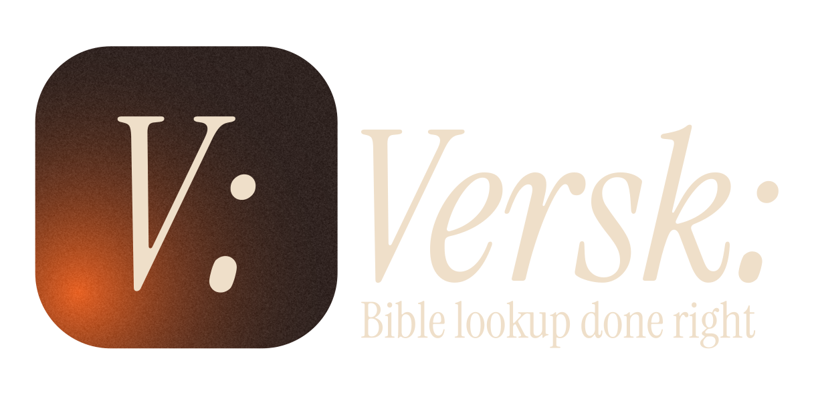
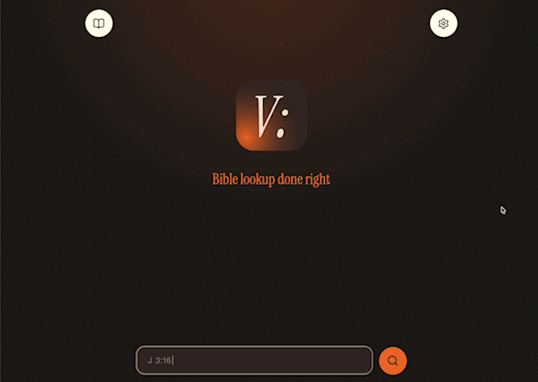

<p align="center">
  
</p>

# Verski

Verski is a fast, offline-first Bible passage lookup application. Type a
reference, press Enter, and immediately read or copy the passage.

**Live demo:** [verski.pages.dev](https://verski.pages.dev)

<p align="center">
  
</p>


## Highlights

- Fast reference parsing with English and Polish book names and abbreviations.
- Offline translation storage with recovery after browser data eviction.
- Bible book and chapter navigation.
- English and Polish interface localization.
- Persistent themes, reading preferences, and recent lookups.
- Installable Progressive Web App (PWA).

## Available translations

- World English Bible ([WEB](https://ebible.org/bible/details.php?all=1&id=engwebp))
- Uwspółcześniona Biblia Gdańska ([UBG](https://ebible.org/bible/details.php?all=1&id=polubg))

## Technology

Verski is built with SvelteKit, TypeScript, Zod, Pico CSS, Paraglide JS,
IndexedDB, Service Workers, Vitest, and Playwright. Production and preview
deployments are hosted on Cloudflare Pages.

## Local development

Requirements:

- Node.js 22.23.1
- npm

```bash
git clone https://github.com/jakestolarsky/verski-app.git
cd verski-app
npm install
npm run dev
```

The generated Bible translation packages required by the application are
included in the repository. The original conversion source files are not
required for a normal development build.

## Verification

```bash
npm run check
npm run lint
npm run test:unit -- --run
npm run test:e2e
npm run build
```

## License

Original Verski application code is available under the
MIT License.
Bible translations, fonts, icons, and other third-party materials retain their
own licenses. See [Third-Party Notices](THIRD_PARTY_NOTICES.md) for details.